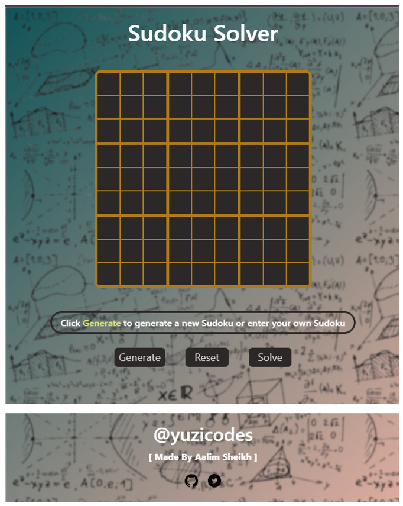

# Sudoku-Flask 🎲

A web-based Sudoku game built using **Flask**! This project offers a simple yet engaging way to play and solve Sudoku puzzles directly in your browser. The app is deployed on **Vercel** for easy access.

<p style="margin-left: 20px;">

</p>
## Features ✨
- **Play Sudoku**: Solve puzzles in a sleek and user-friendly interface.
- **Generate Puzzles**: Get new, random Sudoku puzzles with varying levels of difficulty.
- **Solve Puzzle**: Enter a Sudoku puzzle and click "Solve" to get the solution.
- **Flask Framework**: Built using the Flask micro-framework.
- **Responsive Design**: Optimized for both desktop and mobile.

## Demo 🚀
Check out the live demo here: [Sudoku-Flask on Vercel](https://sudoku-flask.vercel.app/)

<p align="center">
  
</p

## Installation 🛠

Follow these instructions to set up and run the project locally.

### Prerequisites
- Python 3.x
- Flask

### Steps

1. **Clone the repo**
    ```bash
    git clone https://github.com/yuzicodes/Sudoku-Flask.git
    cd Sudoku-Flask
    ```

2. **Install dependencies**
    ```bash
    pip install -r requirements.txt
    ```

3. **Run the Flask app**
    ```bash
    flask run
    ```

4. **Visit the App**  
   Open your browser and go to: `http://127.0.0.1:5000/`

## How It Works ⚙️
The backend logic is written in `app.py`, which manages the routes and game logic. The puzzle generation and solving functions are housed in `sudoku.py`. The frontend, built with **HTML, CSS, and JavaScript**, provides a clean interface for players.

## Project Structure 📂
```bash
.
├── app.py           # Main application file
├── sudoku.py        # Puzzle generator and solver
├── static/          # CSS, JS, and image assets
├── templates/       # HTML templates
├── requirements.txt # Python dependencies
└── README.md        # Project documentation
